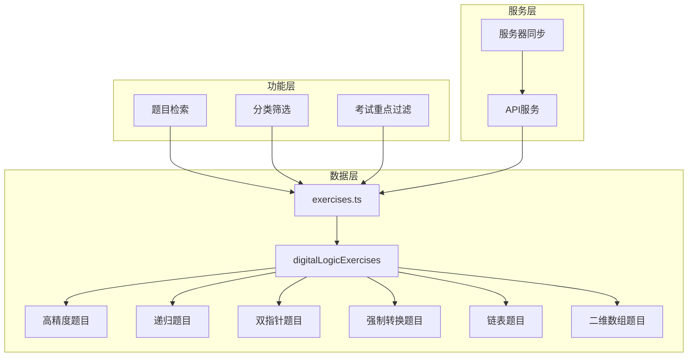

# Design Document

## Overview

本设计文档描述了数字逻辑电路考试题目集的实现方案。题目将按照现有题库结构（`src/data/exercises.ts`）进行组织，新增六个知识点分类的题目，并支持考试重点标记和检索功能。

## Architecture



## Components and Interfaces

### 1. 题目数据结构

使用现有的 `Exercise` 接口，关键字段：

```typescript
interface Exercise {
  id: string;                    // 唯一标识，格式：{category}-{name}
  category: string;              // 分类：高精度/递归/双指针/强制转换/链表/二维数组
  title: string;                 // 题目标题
  description: string;           // 题目描述（OJ格式）
  difficulty: 'easy' | 'medium' | 'hard';
  type: 'coding' | 'fillblank';
  templates?: {...};             // 代码模板
  solutions?: {...};             // 参考答案
  testCases?: {...}[];           // 测试用例
  hints?: string[];              // 提示
  explanation: string;           // 解析
  commonMistakes?: string[];     // 常见错误
  isExamFocus?: boolean;         // 考试重点标记
}
```

### 2. 题目分组导出

```typescript
// 新增导出
export const highPrecisionExercises: Exercise[];   // 高精度
export const recursionExercises: Exercise[];       // 递归（已存在，需扩展）
export const twoPointerExercises: Exercise[];      // 双指针
export const typeCastExercises: Exercise[];        // 强制转换
export const linkedListExercises: Exercise[];      // 链表（已存在，需扩展）
export const array2DExercises: Exercise[];         // 二维数组

// 汇总导出
export const digitalLogicExamExercises: Exercise[];
```

### 3. 检索接口

```typescript
// 按分类筛选
function filterByCategory(category: string): Exercise[];

// 按关键词搜索（搜索title、description、category）
function searchExercises(keyword: string): Exercise[];

// 获取考试重点题目
function getExamFocusExercises(): Exercise[];
```

## Data Models

### 题目ID命名规范

| 分类 | ID前缀 | 示例 |
|------|--------|------|
| 高精度 | hp- | hp-add, hp-multiply |
| 递归 | rec- | rec-factorial, rec-hanoi |
| 双指针 | tp- | tp-two-sum, tp-palindrome |
| 强制转换 | tc- | tc-int-char, tc-overflow |
| 链表 | ll- | ll-insert, ll-reverse |
| 二维数组 | arr2d- | arr2d-transpose, arr2d-spiral |

### 题目难度分布

每个分类的题目难度分布建议：
- Easy: 40%
- Medium: 40%
- Hard: 20%

## Correctness Properties

*A property is a characteristic or behavior that should hold true across all valid executions of a system-essentially, a formal statement about what the system should do. Properties serve as the bridge between human-readable specifications and machine-verifiable correctness guarantees.*

Property 1: Category exercise count
*For any* category in the exercise database, the number of exercises in that category should meet the minimum requirement (高精度≥3, 递归≥4, 双指针≥3, 强制转换≥2, 链表≥4, 二维数组≥3)
**Validates: Requirements 1.1, 2.1, 3.1, 4.1, 5.1, 6.1**

Property 2: Exercise structure completeness
*For any* exercise in the database, it should contain all required fields (id, category, title, difficulty, type, description), and coding exercises should have templates/solutions/testCases, fillblank exercises should have codeTemplate/blanks
**Validates: Requirements 7.1, 7.2, 7.3**

Property 3: Exam focus marking consistency
*For any* exercise marked as exam focus, the isExamFocus field should be true
**Validates: Requirements 1.3, 2.3, 3.3, 4.3, 5.3, 6.3, 7.4**

Property 4: Search returns correct category
*For any* search keyword that matches a category name, all returned exercises should belong to that category or contain the keyword in title/description
**Validates: Requirements 1.4, 2.4, 3.4, 4.4, 5.4, 6.4**

Property 5: Common mistakes field for pointer operations
*For any* exercise involving pointer operations (链表, 强制转换), the commonMistakes field should exist and be non-empty
**Validates: Requirements 4.2, 5.2**

## Error Handling

1. **题目ID重复**: 在添加题目时检查ID唯一性，重复则抛出错误
2. **必填字段缺失**: 验证题目结构完整性，缺失字段时提示具体缺失项
3. **测试用例格式错误**: 验证testCases数组中每个元素包含input、expectedOutput、description
4. **服务器同步失败**: 提供重试机制和错误日志

## Testing Strategy

### 单元测试

使用 Vitest 进行单元测试：

1. 测试题目数据结构完整性
2. 测试分类筛选功能
3. 测试关键词搜索功能
4. 测试考试重点过滤功能

### 属性测试

使用 fast-check 进行属性测试：

1. 验证所有分类的题目数量满足最低要求
2. 验证所有题目的数据结构完整性
3. 验证搜索功能返回正确结果
4. 验证考试重点标记的一致性

### 测试配置

```typescript
// 属性测试配置
fc.configureGlobal({ numRuns: 100 });
```
